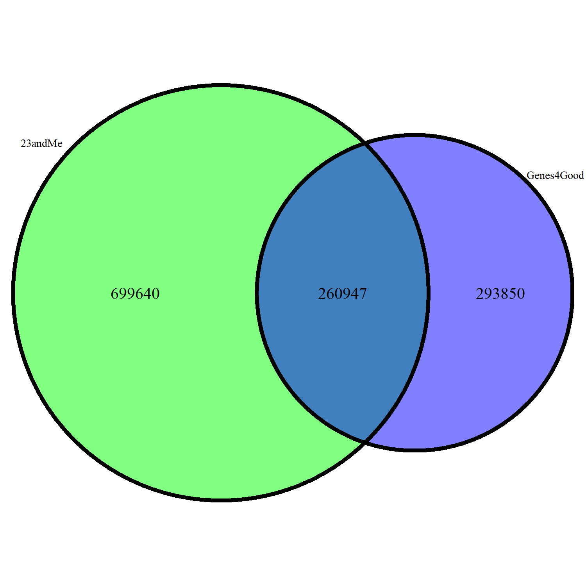

[Genes for Good](https://genesforgood.sph.umich.edu/) is crowd-sourced study on genetic variation using SNP chips.  So, it is similar to 23andMe, except it is free for participants and different types of results are provided (and the SNP chips are not identical).

My 23andMe sample is from several years ago, on their V3 chip.  My Genes for Good sample was collected a couple years ago.  So, I don't know exactly how the latest results would compare, but I've provided a Venn Diagram below showing the overlap of probes (based upon genomic position, which is similar but slightly better than using the probe name):

Raw data is provided in a few different formats, including .vcf format and 23andMe raw data format.  So, most of the scripts for analyzing 23andMe data can also be applied to Genes for Good data.

So, I am going to mostly use this page for notes on HLA typing with my different genomics technologies.  Namely, there was a [recent study](https://www.ncbi.nlm.nih.gov/pubmed/28490672) using imputed HLA types from SNP chip data, so I would like to test how my own imputed results compare to those from Illumina DNA-Seq (mostly from Genos Exome .fastq files, since the Veritas WGS raw data was a set of bams with aligned reads for each canonical chromosome, with a noticable drop in coverage in the highly variable HLA region on chr6).

<table>
  <tbody>
    <tr>
      <th align="center">Marker</th>
      <th align="center">SNP2HLA</th>
      <th align="center">HIBAG</th>
      <th align="center">bwakit</th>
      <th align="center">HLAminer</th>
    </tr>
    <tr>
      <td align="center">HLA-A</td>
      <td align="left">A*01, A*02 (23andMe)  A*01, A*02 (Genes for Good)</td>
      <td align="left">A*01, A*02 (23andMe)</td>
      <td align="left">A*01, A*02 (Genos Exome BWA-MEM)</td>
      <td align="left">A*01, A*02 (Genos Exome BWA-MEM)  A*01, A*68 (Genos Exome BWA)</td>
     </tr>
    <tr>
      <td align="center">HLA-B</td>
      <td align="left">B*08, B*40 (23andMe)  B*08, B*40 (Genes for Good)</td>
      <td align="left">B*08, B*40 (23andMe)</td>
      <td align="left">B*08, B*40 (Genos Exome BWA-MEM)</td>
      <td align="left">B*08, B*40 (Genos Exome BWA-MEM)  B*08, B*41 (Genos Exome BWA)</td>
     </tr>
    <tr>
      <td align="center">HLA-C</td>
      <td align="left">C*03, C*07 (23andMe)  C*03, C*07 (Genes for Good)</td>
      <td align="left">C*03, C*07 (23andMe)</td>
      <td align="left">C*03, C*07 (Genos Exome BWA-MEM)</td>
      <td align="left">C*03, C*07 (Genos Exome BWA-MEM)  C*03, C*07 (Genos Exome BWA)</td>
     </tr>
    <tr>
      <td align="center">HLA-DRB1</td>
      <td align="left">DRB1*01, DRB1*03 (23andMe)  DRB1*01, DRB1*03 (Genes for Good)</td>
      <td align="left">DRB1*03, DRB1*11 (23andMe)</td>
      <td align="left">DRB1*04, DRB1*04 (Genos Exome BWA-MEM)</td>
      <td align="left">DRB1*01, DRB1*15 (Genos Exome BWA-MEM)  DRB1*01, DRB1*15 (Genos Exome BWA)</td>
     </tr>
     <tr>
      <td align="center">HLA-DQA1</td>
      <td align="left">DQA1*05, DQA1*05 (23andMe)  DQA1*01, DQA1*05 (Genes for Good)</td>
      <td align="left">DQA1*05, DQA1*05 (23andMe)</td>
      <td align="left">DQA1*03, DQA1*03 (Genos Exome BWA-MEM)</td>
      <td align="left">DQA1*02, DQA1*03 (Genos Exome BWA-MEM)  DQA1*02, DQA1*03 (Genos Exome BWA)</td>
     </tr>
     <tr>
      <td align="center">HLA-DQB1</td>
      <td align="left">DQB1*02, DQB1*05 (23andMe)  DQB1*02, DQB1*02 (Genes for Good)</td>
      <td align="left">DQB1*02, DQB1*03 (23andMe)</td>
      <td align="left">DQB1*03, DQB1*03 (Genos Exome BWA-MEM)</td>
      <td align="left">DQB1*02, DQB1*03 (Genos Exome BWA-MEM)  DQB1*02, DQB1*03 (Genos Exome BWA)</td>
     </tr>
</tbody>
</table>

So, for the Genos Exome Alignments, HLAminer assignments were more similar to bwakit if using BWA-MEM instead of BWA for HLA-A and HLA-B (and bwakit / HLAminer made the same assignments for HLA-C, HLA-DQA1, and HLA-DQB1), but there were discrepancies for the top DRB1 assignments (between the Exome HLA calls).

For HLA-A, HLA-B, and HLA-C, the imputed HLA types from the SNP chips match the BWA-MEM HLA assignments (for either HLAtype or bwakit).

For SNP chips, the [dbSNP](https://www.ncbi.nlm.nih.gov/projects/SNP/) rsIDs (or, more precisely, the snpID in the genotype file) rather than chromosomal position is used for HLA2SNP and HIBAG.  In the case of HIBAG, there was an error message for my Genes for Good file (which I created from the 23andMe-formated genotype file) due to duplicate snpIDs.
