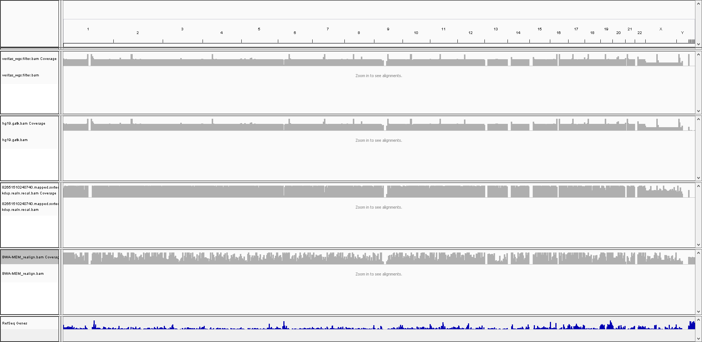
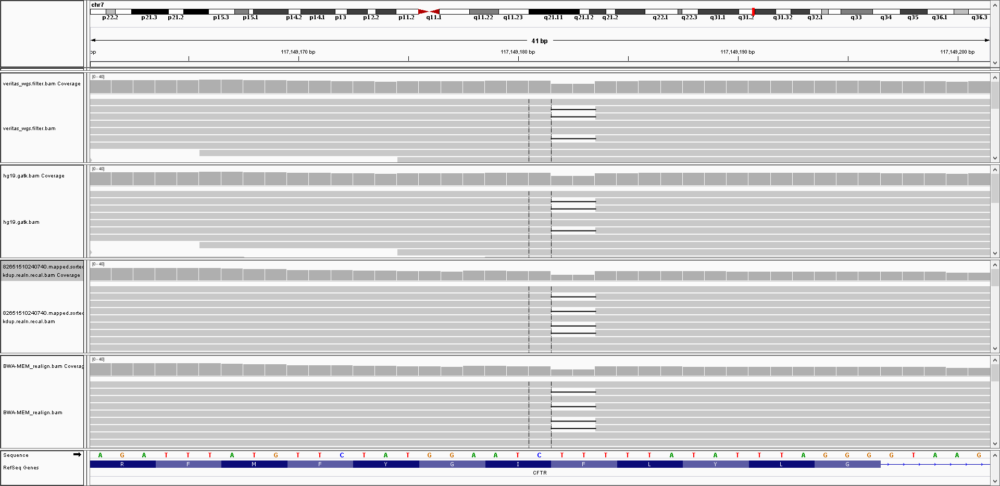

### For Research Purposes Only! ###

The Genos website says that they used an [Agilent SureSelect Commercial](https://genos.co/sequencing.html) kit.  This is a commonly used platform, and kit information can be downloaded from [SureDesign](https://earray.chem.agilent.com/suredesign/).  However, you are supposed to register using a work e-mail (a personal Gmail account won't work), and there multiple types and versions of SureSelect kits.  So, as an approximation, I downloaded exon .bed files from the [UCSC Genome Browser](https://genome.ucsc.edu/), testing different flanking lengths for coverage approximations.

**Download hg19 Exon Locations in .bed Format**

*Step #1*) Go to the [UCSC Table Browser](https://genome.ucsc.edu/cgi-bin/hgTables)

*Step #2*) Make sure clade is "Mammal", genome is "human", and assembly is "Feb 2009 (GRCh37/hg19)"

*Step #3*) Select the type of gene annotation.  So, group should be "Genes and Gene Predictions" and the type of gene annotation is listed under the track pull-down.  I tested "RefSeq", "UCSC", and "GENCODE Genes V19".

*Step #4*) Make sure region is set to "genome"

*Step #5*) Select .bed output format

*Step #6*) Provide an output file name for "output file".  For example "RefSeq_genes_0bp_flanking.bed"

*Step #7*) Click "get output"

*Step #8*) On the next screen, select the radio button for the desired regions.

You can try "Exons Plus [n] bases at each end" (where the default setting of n is 0), but based upon visualization of the GAPDH gene, it looks like only CDS regions were covered.  So, the best representative coverage statistic will likely come from regions defined with "Coding Exons" (which I test in a table below).

*Step #9*) Click "get BED" to download your file

**Download Karyotype-Ordered Reference**

Please note that reference should be karyotpe-ordered (starting with chrM), to match provided alignment reference (or if using GATK functions on a new alignment from the .fasta files).

If you've already run the Veritas WGS scripts, the karyotype reference does not contain supplemental chromosomes because the raw data was separate chromosome alignments for the primary chromosomes (and re-alignment scripts use reads extracted from a combined .bam file, which won't contain unaligned reads).  So, a different karyotype-sorted reference would still need to be created.

Currently, you can download such a file from ftp://ftp.broadinstitute.org/bundle/hg19/

If the link above doesn't work, you can [click here](https://software.broadinstitute.org/gatk/download/bundle), click the link under "FTP Server Access", and then click on the "hg19" subfolder.  You can decompress the reference using `gunzip` in the Docker image or [7-Zip](http://www.7-zip.org/download.html) on Windows.

**Convert .bed File to .target_intervals for Picard**

I use [Picard](https://broadinstitute.github.io/picard/) for file-conversion and coverage statisics (and some down-stream steps).  You can download all the programs separately, but I'm providing instruction assuming that you are using my [dnaseq-dependencies](https://hub.docker.com/r/cwarden45/dnaseq-dependencies/) Docker image.  Please see the [Veritas WGS](https://github.com/cwarden45/DTC_Scripts) README with some additional information about setting up Docker.

*Step #1*) If you have not done so already, you'll need to have downloaded a copy of the hg19 reference genome in FASTA format.  Please see the main [Veritas WGS](https://github.com/cwarden45/DTC_Scripts) README with some additional information about setting up Docker.

*Step #2*) If you have downloaded the appropriate .bed file, you can create the interval list (which also creates the .dict file for the refernece, if it doesn't already exist) by running `python create_interval_file.py --input=targets.bed --ouput=targets.interval_list --ref=hg19.fa`.  If running the script within the downloaded folder, after the Veritas WGS scripts, the RefSeq gene interval list would be created with the command `python create_interval_file.py --input=RefSeq_genes_CDS.bed --output=RefSeq_genes_CDS.interval_list --ref=hg19.karyotype.fasta`

You can type `python create_interval_file.py --help` for more information.

**Coverage Metrics for Provided .bam Alignment File**

If you've created the appropriate .interval_list file, you can calculate coverage statistics by running `python calculate_coverage_statistics.py --alignment=sample.bam --intervals=targets.interval_list --ref=hg19.fa`.  If running the script within the downloaded folder, after the Veritas WGS scripts, the RefSeq gene interval list would be created with the command `python calculate_coverage_statistics.py --alignment=[sampleID].mapped.sorted.markdup.realn.recal --intervals=RefSeq_genes_CDS.interval_list --ref=ucsc.hg19.fasta`.  By default, the prefix for the output is the concatination of the name for the .bam file and the .interval_list file, but this can be manually specified using `--output_prefix=prefix`.

| Annotation | Flanking | Avg Cov | Percent 10x | Percent 20x |
|---|---|---|---|---|
|RefSeq CDS|0 bp|126.8x|88.1%|84.7%|
|RefSeq Exon|0 bp|59.1x|43.0%|40.7%|
|UCSC CDS|0 bp|125.5x|87.5%|84.1%|
|UCSC Exon|0 bp|56.7x|41.8%|39.4%|
|GENCODE CDS|0 bp|126.2x|87.9%|84.5%|
|GENCODE Exon|0 bp|51.6x|38.0%|35.8%|

*CDS = Coding exons

*Average coverage (Avg Cov) = MEAN_TARGET_COVERAGE

*Percent 10x = PCT_TARGET_BASES_10X

*Percent 20x = PCT_TARGET_BASES_20X

Just for fun, I ran calculated the target metrics for the RefSeq CDS regions on an BWA-MEM alignment of reads that I extracted from my Veritas WGS sample.  For that 20x whole-genome sequencing file, the average coverage was 21.4x, the percent 10x coverage was 91.4%, and the percent 20x coverage was 69.1%.

**Re-Align Reads and Re-Call Variants**

*Step #1*) Align / Sort / Filter Reads (with summary statistics)

Your reads should be in the format *[sampleID]_read1.fastq.gz* for the forward read and *[sampleID]_read2.fastq.gz* for the reverse read.

If you've done everything in order, you should have all the necessary imput files.  You can run this set of commands with `python exome_alignment.py --read_prefix=[sampleID] --intervals==RefSeq_genes_CDS.interval_list --ref=ucsc.hg19.fasta`.  By default, the prefix for output files is `BWA-MEM_realign`, but this can be manually specified using `--output_prefix=prefix`.

*Step #2*) Call Variants.

You should be able to use `run_GATK_VarScan.py` from the main  [Veritas WGS](https://github.com/cwarden45/DTC_Scripts) page.  If you've followed the steps above, you should be able to call variants using `python ../run_GATK_VarScan.py --bam=BWA-MEM_realign.bam --ref=ucsc.hg19.fasta`

**Filter Off-Target Variants**

In general, shouldn't really matter for non-synonymous mutations in known genes, but you might want restrict non-coding regulatory variants within target regions.  In this case, enrichment is for CDS regions, but you can still test the effect of filtering different mutation calling strategies and/or checking how the regions for your annotation program of choice compares to covered regions (here, gene CDS boundaries from the UCSC genome browser).

Also, if you are comfortable modifying Python code, you can use `filter_variants_GATK.py` to filter for on-target variants (such as the RefSeq CDS regions downloaded from the [UCSC Table Browser](https://genome.ucsc.edu/cgi-bin/hgTables) in the 1st step).

If comparing variants, please keep in mind that freebayes has a different format to represent indels.  So, if you are looking for exact matches between .vcf files, indel concordance with GATK / VarScan will be underestimated.

### Other Notes ###

Unless specified differently above, I used scripts / strategies described in the main [Veritas WGS](https://github.com/cwarden45/DTC_Scripts) page.

### Personal Notes ###

Here are coverge screenshots for two different processing strategies for my WGS (top 2) and Exome (bottom 2) genome sequences.  Since I am a male, notice that chrX coverage is lower than the autosomal chromosomes:

Here is a screenshot verifying the presence of a cystic fibrosis variant idetnified by 23andMe (identified as pathogenic in ClinVar, as indicated in the [dbSNP](https://www.ncbi.nlm.nih.gov/snp/rs121908769#clinical_significance) entry).  You won't see it in my GET-Evidence reports (which you can see on my PGP page, for [hu832966](https://my.pgp-hms.org/profile/hu832966)) due to indel formatting incompatibilities, and I was reported as **not** being a carrier in my Mayo GeneGuide report (also posted on my Personal Genome Project page) because it wasn't tested for.  Again, top 2 tracks are WGS (same sample, different processing), and bottom 2 tracks are Exome (same sample, different processing):

**To be fair, neither Veritas nor Genos indicated I was a Cystic Fibrosis carrier in their results (even though you can see the variant in the above alignments).**  However, my overall impression wasn't highly negative because they didn't place a lot of emphasis on the reports, and I believe having the raw data that can be tested with multiple free intepretation programs is arguably what is most important.  Plus, [Robert Sicko](https://www.biostars.org/u/6771/) was kind enough to [point out](https://www.biostars.org/p/361415/#366495) there are some GET-Evidence CFTR variants, and I believe [CFTR-L88Shift](https://collections.su92l.arvadosapi.com/collections/01164baa9164e211213df3b7f13234da+2096/get-evidence-report.html) in the "Insufficiently evaluated variants" is an alias for the delTT variant (also known as [Leu88fs](https://www.ncbi.nlm.nih.gov/snp/rs121908769#aliases_tab)); so, I thought that the lack of that variant was due to an indel formatting issue, but the precise explanation is probably a little different.  However, either way, I think the emphasis on the raw data could be made more clear if ***not*** requiring an on-line physican to sign-off on the order.

