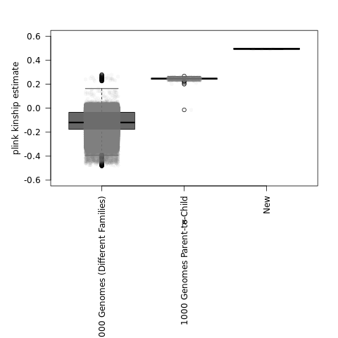
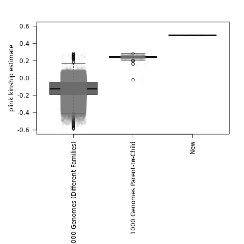
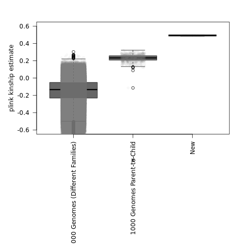
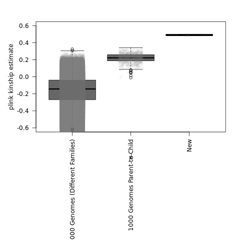
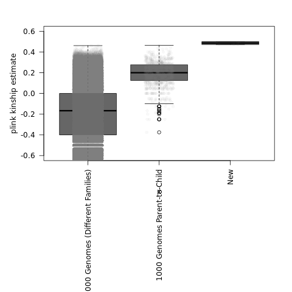
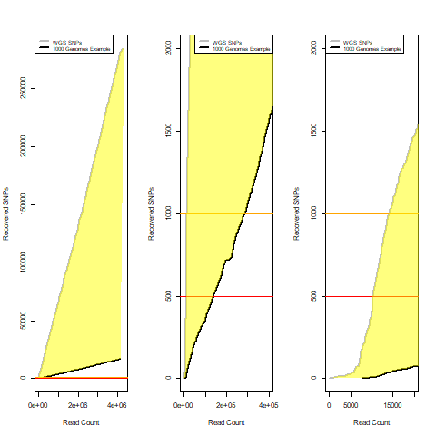

## Kinship estimates with 77,072 variants


```
FAM1	ID1	FAM2	ID2	nsnp	hethet	ibs0	kinship
0	CW23	0	GFG	77072	0.605148	0	0.499962
0	Veritas.BWA	0	GFG	76310	0.605032	0	0.499865
0	Veritas.BWA	0	CW23	76310	0.605032	0	0.499859
0	Nebula	0	GFG	77072	0.584596	7.78493e-05	0.489209
0	Nebula	0	CW23	77072	0.584596	7.78493e-05	0.489181
0	Nebula	0	Veritas.BWA	76310	0.58472	6.55222e-05	0.489226
```

## Kinship estimates with 7,707 variants


## Kinship estimates with 3,853 variants



## Kinship estimates with 1,541 variants


While not as bad as the lower variant counts, I think this is approximately where I notice greater variability in the **1000 Genomes parent-to-child** relatedness estimates.

## Kinship estimates with 770 variants


```
FAM1	ID1	FAM2	ID2	nsnp	hethet	ibs0	kinship
0	CW23	0	GFG	770	0.605195	0	0.5
0	Veritas.BWA	0	GFG	763	0.605505	0	0.5
0	Veritas.BWA	0	CW23	763	0.605505	0	0.5
0	Nebula	0	GFG	770	0.584416	0	0.489514
0	Nebula	0	CW23	770	0.584416	0	0.489514
0	Nebula	0	Veritas.BWA	763	0.584535	0	0.489421
```

## Kinship estimates with 256 variants


## Kinship estimates with 154 variants



## Kinship estimates with 77 variants



## Kinship estimates with 38 variants


## Kinship estimates with 19 variants


```
FAM1	ID1	FAM2	ID2	nsnp	hethet	ibs0	kinship
0	CW23	0	GFG	19	0.526316	0	0.5
0	Veritas.BWA	0	GFG	19	0.526316	0	0.5
0	Veritas.BWA	0	CW23	19	0.526316	0	0.5
0	Nebula	0	GFG	19	0.473684	0	0.472222
0	Nebula	0	CW23	19	0.473684	0	0.472222
0	Nebula	0	Veritas.BWA	19	0.473684	0	0.472222
```

## Kinship estimates with 9 variants


```
FAM1	ID1	FAM2	ID2	nsnp	hethet	ibs0	kinship
0	CW23	0	GFG	9	0.777778	0	0.5
0	Veritas.BWA	0	GFG	9	0.777778	0	0.5
0	Veritas.BWA	0	CW23	9	0.777778	0	0.5
0	Nebula	0	GFG	9	0.666667	0	0.458333
0	Nebula	0	CW23	9	0.666667	0	0.458333
0	Nebula	0	Veritas.BWA	9	0.666667	0	0.458333
```

Even with ~0.5x lcWGS, it looks like a relatedness estimate of ~0.45 is as low as I might get.  However, notice that the 2 SNP chips and Vertias WGS estimates **remained higher with a relatedness estimate of 0.50**.

This may be useful for having an absolute threshold for lcWGS with fewer reads.  **However, the extra variability of the other relatedness estimates became more of an issue more quickly, so I am not actually saying I recommend making these estimates with 9 variants.**

For example, back at **~100 variants**, the parent-to-child and more distant relationships had overlap, and you started getting parent-to-child and/or more distant 1000 Genomes estimates that were artifically high (~0.40) with **~40 variants**.

So, if I need to prioritize quality over number of variants (and it is possible to accurately estimate that), I think the parent-to-child variation most noticably increased ~1,000 variants.  So, if you had >2,000 variants, maybe I would be more concerned about the accuracy of the variant calls than the number of variants (for self-identification)?

## Recovery of 2 SNP lists with support from at least 1 read



While recovery of potentially informative SNPs was noticably higher (noticeably lower at roughly 100,000 to 300,000 reads, but perhaps more in line with the 0.1x limit on uploading files to Gencove), but the abilty to recover ~1000 SNPs (with any variant frequency, in any population) from my regular WGS data was close to the 15,000 estimate from the Color lcWGS data).

**So, if you consider rare SNPs (instead of calculating a relatedness estimate), perhaps you could identify yourself with less than 50,000 reads?**
